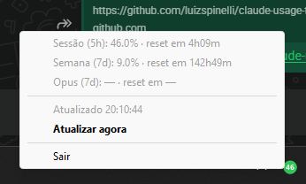

# Claude Usage Tray

System tray indicator for Claude.ai 5-hour session usage. Reads the OAuth token from Claude Code — no login required.

<p align="center">
  
</p>

## Install

```bash
git clone https://github.com/luizspinelli/claude-usage-tray.git
cd claude-usage-tray
pip install -r requirements.txt
python claude_usage_tray.py
```

**Windows one-click:** Run `install.bat` — installs deps, copies to AppData, adds to Startup.

## Features

- 🟢 Green (0-49%), 🟡 Yellow (50-79%), 🔴 Red (80%+), ⚪ Gray (error)
- Right-click menu: 5h session, 7d week, 7d Opus usage
- Desktop notifications at 80%, 90%, 100%
- Auto-refresh every 60 seconds

## Requirements

- Python 3.9+
- Claude Code signed in

## Token

The app finds your token automatically from:
- Windows: Credential Manager
- macOS: Keychain  
- Linux: `~/.claude/.credentials.json`
- Or set `CLAUDE_OAUTH_TOKEN` env var

## Disclaimer

This is a personal utility provided as-is, with no warranty. Uses an unofficial Anthropic API endpoint that may change or break at any time. Use at your own risk.

## License

MIT
